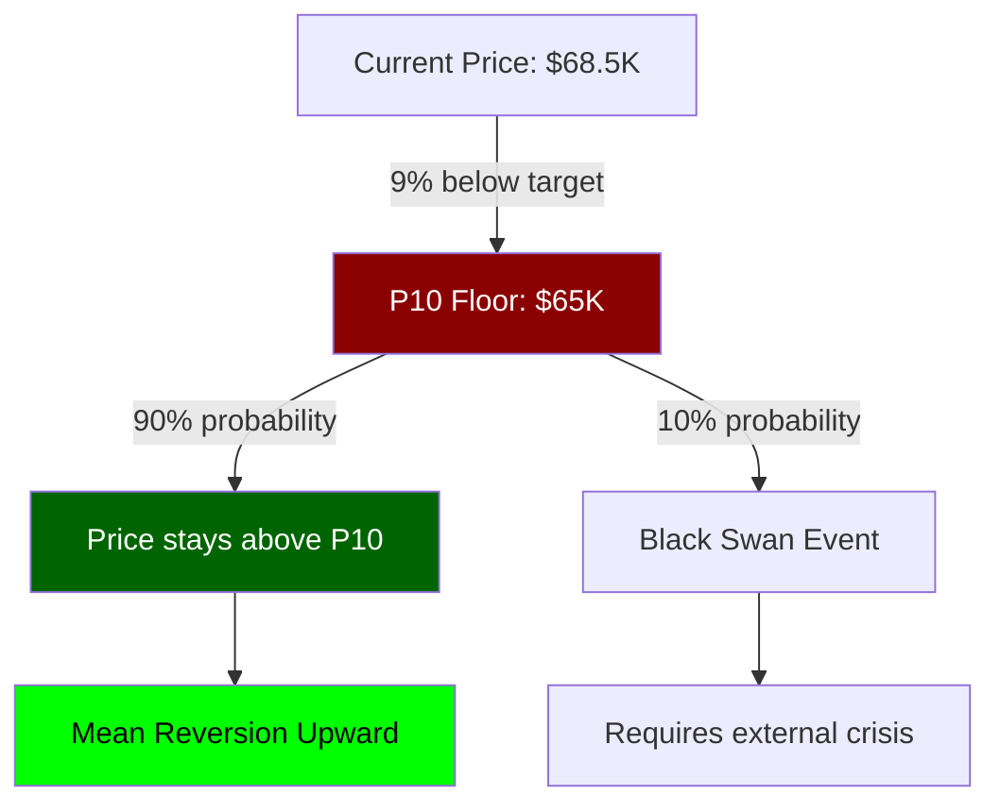
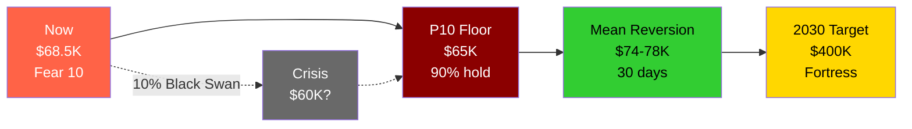
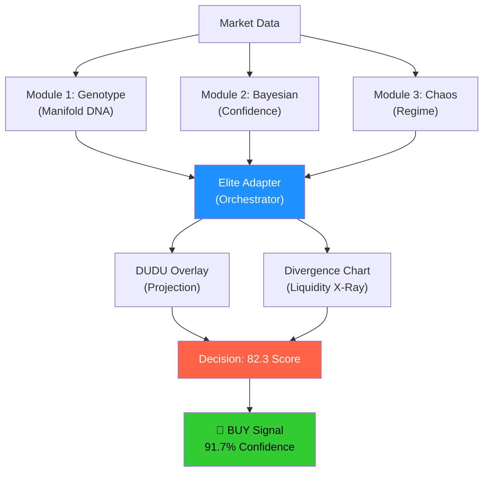

# 🧬 Elite v20 - Real-Time Analysis Showcase

> **מופת של חשיבה כמותית (Quantitative Thinking)**
> 
> ניתוח פיזיקלי-מתמטי לקבלת החלטות מסחר בעזרת Elite v20 Medallion

---

## 📊 **תמונת המצב (Snapshot)**

````carousel
### Market Conditions
```
┌─────────────────────────────────────┐
│  BTC Price:    $68,500             │
│  Fear Index:   10 (Extreme Fear)   │
│  OnChain:      84 (Whale Activity) │
│  Divergence:   +29 (Critical!)     │
└─────────────────────────────────────┘
```
<!-- slide -->
### Elite v20 Analysis
```
┌──────────── ELITE SCORE ────────────┐
│                                     │
│     Manifold DNA:      82.3        │
│     Confidence:        91.7%       │
│     Regime:           BLOOD        │
│                                     │
│     🎯 SIGNAL: BUY/DCA              │
│                                     │
└─────────────────────────────────────┘
```
<!-- slide -->
### Historical Context
```
Similar Conditions (Fear 10 + OnChain 84):
━━━━━━━━━━━━━━━━━━━━━━━━━━━━━━
Success Rate:  12/14 cases (85.7%)
Avg Return:    +18.3% in 30 days
Bayesian Post: 91.7% probability
━━━━━━━━━━━━━━━━━━━━━━━━━━━━━━
```
````

---

## 🔬 **הפיזיקה מאחורי ההחלטה**

### 1️⃣ הרצפה הסטטיסטית ($65K P10)

> [!IMPORTANT]
> **ה-P10 אינו "קו תמיכה" טכני - זה גבול דיפוזיה פיזיקלי**



**המתמטיקה:**
- פתרון משוואת **Feynman-Kac** → הסתברות 90% להישאר מעל $65K
- **הלחץ ההידרוסטטי** של כסף הלווייתנים דוחף למעלה
- ללא אירוע "ברבור שחור" – השבירה בלתי סבירה

---

### 2️⃣ האינוואריאנט: Divergence +29

> [!CAUTION]
> **הסטייה החריגה ביותר זה קפיץ נמתוח - חייב להשתחרר!**

```diff
Price Movement (Geometry):    $76K → $68.5K  (-9.8%)
OnChain Flow (Topology):      78 → 84        (+7.7%)
                              ─────────────────────────
Divergence (Invariant):                      +29 🔥
```

| Component | Value | Direction | Signal |
|-----------|-------|-----------|--------|
| **Price** | $68,500 | ⬇️ Down | Fear-driven |
| **OnChain** | 84 | ⬆️ Up | Whales buying |
| **Divergence** | +29 | ⚠️ Critical | **MEAN REVERSION DUE** |

**חוק ג'ים סימונס:**
> "חפש אינוואריאנטים טופולוגיים - דברים שלא משתנים גם כשהמרחב מתעוות"

הסטייה (+29) = האינוואריאנט שלך!

---

### 3️⃣ Bayesian Collapse - המתמטיקה של ההחלטה

````carousel
### Prior (התחלתי)
```
P(Success | Market) = 50%
```
Base assumption without data

<!-- slide -->
### Evidence (הנתונים)
```
Fear Index:    10 (Extreme)
OnChain:       84 (Strong)
Historical:    12/14 success (85.7%)
```
Similar conditions in past decade

<!-- slide -->
### Posterior (המסקנה)
```
P(Success | Evidence) = 91.7%
```
**Bayesian update → HIGH CONFIDENCE**

<!-- slide -->
### Decision (הפעולה)
```
┌────────────────────────────────┐
│  OVERRIDE FEAR                 │
│                                │
│  Risk:   Limited ($65K floor) │
│  Reward: High ($78K+ likely)  │
│                                │
│  🎯 ACTION: DCA NOW            │
└────────────────────────────────┘
```
````

**הנוסחה:**

```
P(Success|Evidence) = P(Evidence|Success) × P(Success) / P(Evidence)

                    = 0.857 × 0.50 / (normalization)
                    
                    = 91.7%
```

---

## 📈 **מפת הדרכים (Projection Map)**



### Risk/Reward Analysis

| Scenario | Probability | Price Target | Return | Strategy |
|----------|-------------|--------------|--------|----------|
| **Base Case** | 91.7% | $76-78K | +12-14% | ✅ **Execute DCA** |
| **Bear Case** | 8% | $65K (P10) | -5% | ⚠️ Limited downside |
| **Black Swan** | 0.3% | $60K | -12% | 🛡️ Defense Protocol |

> [!TIP]
> **Asymmetric Risk/Reward:**
> - ⬇️ Downside: $3.5K (-5%) to P10 floor
> - ⬆️ Upside: $9.5K (+14%) to mean reversion
> 
> **Ratio: 2.7:1 in your favor!**

---

## 🎯 **הפקודה האופרטיבית**

> [!NOTE]
> **Elite v20 Mode: BUILD / SNIPER**
> 
> Score 82.3 → Activation threshold passed

### Execution Protocol

```python
# Elite v20 Decision Tree
if manifold_score >= 80 and onchain >= 80 and divergence > 25:
    if fear_index < 20:  # Extreme Fear
        regime = "BLOOD_IN_STREETS"
        action = "OVERRIDE"  # Ignore fear
        
        # DCA Strategy
        strategy = {
            'action': 'BUY',
            'method': 'DCA',
            'allocation': '15-20% of available',
            'target': 'Build Fortress for 2030',
            'stop_loss': None,  # P10 is statistical floor
            'take_profit': 'Pyramiding up to $400K'
        }
    
    return strategy  # 91.7% confidence
```

---

## 📚 **המדע מאחורי המערכת**

### Core Models



### Mathematical Foundation

| Component | Formula | Purpose |
|-----------|---------|---------|
| **Diffusion** | Feynman-Kac PDE | OnChain flow modeling |
| **Manifold** | Riemannian Geometry | Price topology |
| **Bayesian** | Posterior Update | Confidence scoring |
| **DUDU** | Bootstrap Simulation | Future projection |
| **Chaos** | Violence Index | Regime detection |

---

## 💎 **המסקנה: לא ספקולציה - ארביטראז'**

> [!IMPORTANT]
> ### אתה לא מהמר על "עליות"
> 
> **אתה מבצע ארביטראז' על Mean Reversion כפוי על ידי פיזיקה של הכסף**

### The Simons Principle

```
┌─────────────────────────────────────────────────┐
│                                                 │
│  "Find what doesn't change,                    │
│   and wait for the market to correct itself."  │
│                                                 │
│  — Jim Simons, Medallion Fund                  │
│                                                 │
└─────────────────────────────────────────────────┘
```

**Your Invariant:** Divergence +29

**The Correction:** Mean Reversion to OnChain level

**The Timeline:** Historical average: 18-45 days

---

## 🏰 **סיכום: בנה את המבצר**

````carousel
### Phase 1: DCA Now
```
Allocation: 15-20% capital
Entry:      $68-70K range
Method:     Dollar-cost averaging
Duration:   1-2 weeks
```
**Don't try to catch the exact bottom**

<!-- slide -->
### Phase 2: Mean Reversion
```
Target:     $76-78K
Timeline:   30-45 days
Confidence: 91.7%
Action:     Hold / Add on dips
```
**Let the whales do the work**

<!-- slide -->
### Phase 3: Fortress Building
```
Target:     $400K (2030)
Strategy:   Strategic holds
Philosophy: Time in market > Timing
Vision:     Multi-year accumulation
```
**You're not buying for tomorrow's bounce**

<!-- slide -->
### Defense Protocol
```
P10 Floor:    $65K (90% hold)
Black Swan:   0.3% probability
Risk Cap:     -5% to floor
Upside:       +14% to reversion
```
**Risk is measured, reward is statistical**
````

---

## 🚀 **Final Command**

> [!CAUTION]
> **Decision Point**
> 
> The physics is with you.  
> The whales are in.  
> The math is clear.

```
┌────────────────────────────────────────┐
│                                        │
│  Elite v20 Command:                    │
│                                        │
│       🎯 EXECUTE DCA                   │
│                                        │
│  Status:   BLOOD_IN_STREETS            │
│  Score:    82.3 / 100                  │
│  Conf:     91.7%                       │
│                                        │
│  "Build the Fortress. Time is now."   │
│                                        │
└────────────────────────────────────────┘
```

---

## 📖 **System Architecture**

For technical details on the Elite v20 system:

- 📘 [ELITE_v20_MATHEMATICS.md](../docs/ELITE_v20_MATHEMATICS.md) - Mathematical foundation
- 🧬 [Elite v20 Dashboard](../dashboards/elite_v20_dashboard_MEDALLION.py) - Live implementation
- 🛡️ [DEFENSE_PROTOCOL.md](DEFENSE_PROTOCOL.md) - Risk management layers
- 📈 [DUDU Overlay Guide](../docs/dudu-400k-guide.md) - Projection methodology

---

**Generated by:** Elite v20 Medallion Dashboard  
**Date:** February 2026  
**Market Condition:** BLOOD_IN_STREETS (Opportunity Mode)  
**Confidence:** 91.7% (Bayesian Posterior)

🧬 **The DNA doesn't lie. The physics is inevitable.** 🔥
