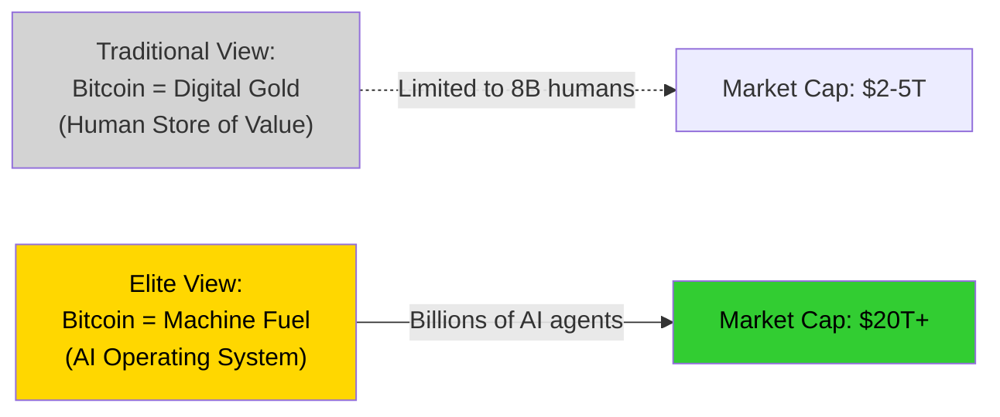
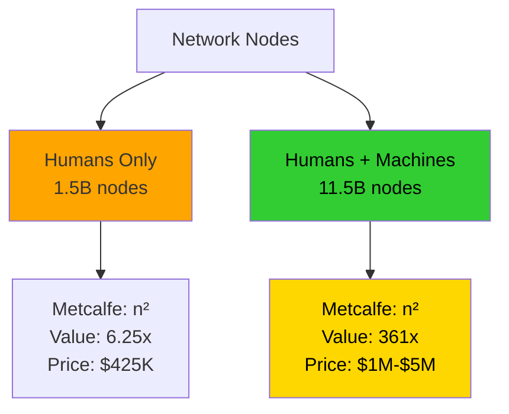
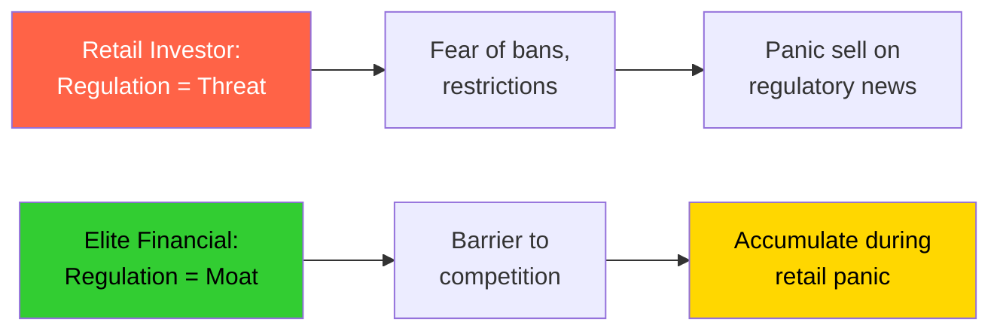
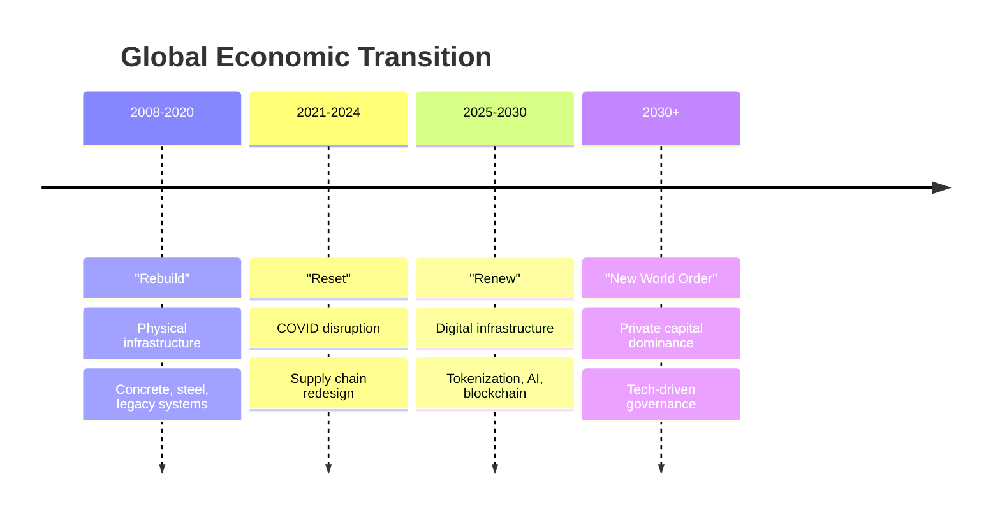
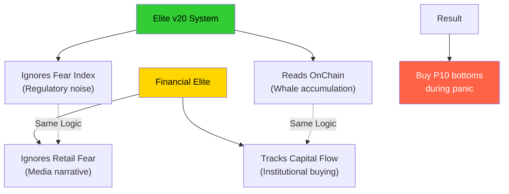
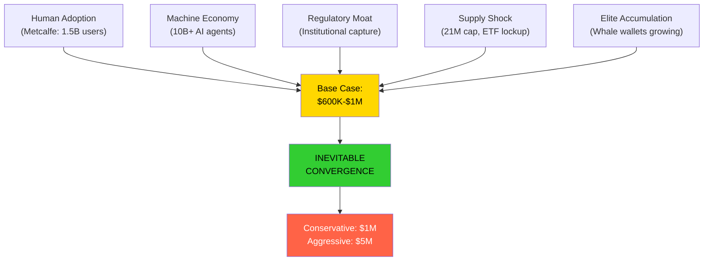

# 🎭 The Elite Playbook - Hidden Drivers to $1M

> **המנועים הנסתרים מאחורי המיליון דולר**
>
> כלכלת המכונה + הרגולציה כחפיר = השתלטות האליטה על הכלכלה החדשה

---

## 📖 **Table of Contents**

1. [Part I: Machine Economy - הדלק של המכונות](#part-i-machine-economy)
2. [Part II: Regulatory Moat - הרגולציה כחפיר](#part-ii-regulatory-moat)
3. [Part III: The Connection to Elite v20](#part-iii-elite-v20-connection)

---

## 🤖 **Part I: Machine Economy - The Hidden Engine**

> [!IMPORTANT]
> **בעוד שהמשקיע הממוצע רואה בביטקוין "מטבע של אנשים", האליטות הפיננסיות בונות תשתית ל"מטבע של מכונות"**

### The Paradigm Shift



---

### 1️⃣ המעבר מ-AI ל-Tokenization ("הדלק של המכונות")

> **השיח העולמי מוסט מ"סתם AI" ל-"Tokenization of Every Financial Asset"**

#### The Problem

````carousel
### AI Agents Need Money
```
Autonomous AI bots need to perform:
━━━━━━━━━━━━━━━━━━━━━━━━━━━━━━━
• Millions of micro-transactions/day
• Pay for data, compute, storage
• Execute trades, contracts, services
━━━━━━━━━━━━━━━━━━━━━━━━━━━━━━━
```

<!-- slide -->

### Banks Can't Help
```
Traditional banking CANNOT:
━━━━━━━━━━━━━━━━━━━━━━━━━━━━━━━
✗ Open accounts for robots
✗ Handle microsecond transactions
✗ Process sub-cent payments
✗ Operate 24/7/365 globally
━━━━━━━━━━━━━━━━━━━━━━━━━━━━━━━
SWIFT/Credit Cards = INCOMPATIBLE
```

<!-- slide -->

### Crypto Wallets = Permissionless
```
Blockchain advantages:
━━━━━━━━━━━━━━━━━━━━━━━━━━━━━━━
✓ No human identity required
✓ Instant settlement
✓ Global, 24/7 operation
✓ Programmable (smart contracts)
━━━━━━━━━━━━━━━━━━━━━━━━━━━━━━━
→ Bitcoin = Natural settlement layer
```
````

**The Implication:** Demand for Bitcoin won't just come from 8 billion humans, but from **billions of AI agents** that need "native internet money" to function.

---

### 2️⃣ Metcalfe's Law על סטרואידים

> **The network value doesn't grow linearly - it explodes**

#### Human vs Machine Adoption

```
Traditional Model (Human Only):
━━━━━━━━━━━━━━━━━━━━━━━━━━━━━━━━━━━━━
Current users:  600M (like Internet 2002)
2030 target:    1.5B
Growth factor:  2.5x
Network value:  2.5² = 6.25x
Bitcoin price:  $68K × 6.25 = $425K
━━━━━━━━━━━━━━━━━━━━━━━━━━━━━━━━━━━━━

Machine Economy Model:
━━━━━━━━━━━━━━━━━━━━━━━━━━━━━━━━━━━━━
Human users:    1.5B
AI agents:      10B+ (autonomous vehicles, 
                      servers, IoT devices)
Total nodes:    11.5B
Growth factor:  19x
Network value:  19² = 361x  🚀
Bitcoin price:  $68K × 361 = $24M (theoretical)
━━━━━━━━━━━━━━━━━━━━━━━━━━━━━━━━━━━━━
Realistic (supply constrained): $1M-$5M
```

> [!CAUTION]
> **Why $1M is Actually Conservative**
>
> The $600K-$1M target assumes MOSTLY human adoption. Machine economy makes this the **floor, not the ceiling**.

#### Visual Representation



---

### 3️⃣ ה-AI כמנהל ההשקעות החדש (הסוף של הרגש)

> **"Death of the Age of Reasoning" - Machines trade without emotion**

#### Current State: Algorithmic Dominance

| Trading Firm | Type | Impact |
|-------------|------|--------|
| **XTX Markets** | Algo trading | $5B+ daily volume |
| **Renaissance Tech** | Quant fund | 39% annual returns (30 years) |
| **Citadel** | Market maker | 20%+ of US equities |
| **Jane Street** | Algo prop | Dominant in crypto options |

**Pattern:** Billions traded daily with ZERO human emotion

#### The 2030 Market Structure

```diff
- 2017: Retail FOMO drives prices
-       (Your uncle buying BTC)
  
- 2021: Corporate treasuries enter
-       (MicroStrategy, Tesla)

+ 2025: Algorithmic dominance begins
+       (Elite v20 at scale)

+ 2030: Machine majority trading
+       (AI funds manage $20T+)
```

#### Why This Matters

> [!TIP]
> **The "Concrete Floor" Effect**
>
> Machines don't panic sell because "news is bad." They buy when models detect value (OnChain divergence), creating a **statistical price floor**.

```python
# Human vs Machine Decision Making
class HumanTrader:
    def decide(self, price, news):
        if news == "scary":
            return "PANIC SELL"  # Emotional
        elif news == "good":
            return "FOMO BUY"    # Emotional

class MachineTrader:
    def decide(self, price, onchain, diffusion):
        p10_floor = feynman_kac_pde(onchain, diffusion)
        
        if price <= p10_floor * 1.05:  # Statistical opportunity
            return "ACCUMULATE"
        elif divergence > 25:           # Mean reversion signal
            return "BUY"
        else:
            return "HOLD"
        
        # NO EMOTION, ONLY MATH
```

**Result:** Volatility ↓, Average Price ↑, Floor Stability ↑

---

### 4️⃣ ביטקוין = TCP/IP של הערך

> **Bitcoin becomes the operating system of the AI economy**

#### The Infrastructure Layer

```
Internet Infrastructure (1990s):
━━━━━━━━━━━━━━━━━━━━━━━━━━━━━━━━━━━
Layer 7: Applications (Web, Email)
Layer 4: Transport (TCP/UDP)
Layer 3: Network (IP)
Layer 1: Physical (Cables, Fiber)
━━━━━━━━━━━━━━━━━━━━━━━━━━━━━━━━━━━

AI Economy Infrastructure (2030):
━━━━━━━━━━━━━━━━━━━━━━━━━━━━━━━━━━━
Layer 7: AI Applications (GPT, etc.)
Layer 4: Smart Contracts (Ethereum)
Layer 3: Value Network (BITCOIN) ← HERE
Layer 1: Compute (GPUs, Quantum)
━━━━━━━━━━━━━━━━━━━━━━━━━━━━━━━━━━━
```

**Bitcoin isn't just "digital gold" - it's the foundational protocol for AI economic transactions.**

---

## 🏛️ **Part II: Regulatory Moat - The Elite Strategy**

> [!IMPORTANT]
> **הציבור רואה ברגולציה "איום" - האליטה רואה "חפיר" (Moat) אסטרטגי**

### The Inverted Perception



---

### 1️⃣ הרגולציה כ"חפיר" וכלי למיסוד

> **"Institutionalization of Digital Assets" - making crypto "kosher" for institutions**

#### The KYC Mechanism

````carousel
### The Old System
```
Traditional Banking:
━━━━━━━━━━━━━━━━━━━━━━━━━━━━━━
Banks control access
→ KYC required
→ High capital requirements
→ Regulatory compliance costs
━━━━━━━━━━━━━━━━━━━━━━━━━━━━━━
Result: MONOPOLY of financial elite
```

<!-- slide -->

### The Crypto Threat
```
Early Crypto (2009-2020):
━━━━━━━━━━━━━━━━━━━━━━━━━━━━━━
Anyone can participate
→ No KYC needed
→ Permissionless access
→ Direct peer-to-peer
━━━━━━━━━━━━━━━━━━━━━━━━━━━━━━
Result: THREAT to banking monopoly
```

<!-- slide -->

### The Elite Solution
```
Regulated Crypto (2024+):
━━━━━━━━━━━━━━━━━━━━━━━━━━━━━━
Banks offer "Crypto Income"
→ Strict KYC required
→ High capital requirements
→ Institutional custody only
━━━━━━━━━━━━━━━━━━━━━━━━━━━━━━
Result: CONTROL restored, innovation captured
```
````

**The Pattern:** Create "green lane" for white money (institutional), block anonymous/private money.

---

### 2️⃣ ה-"Rigged Game": ארביטראז' מוסדי

> **Goldman Sachs playbook: Risk-free arbitrage at public expense**

#### The Old Arbitrage (2008-2024)

```
Goldman Sachs Strategy:
━━━━━━━━━━━━━━━━━━━━━━━━━━━━━━━━━━━━━━
1. Borrow from Fed at 0.1%-0.3%
2. Buy US Treasury bonds at 3%-4%
3. Collect spread: 2.7%-3.9% annually
4. Repeat with $100B+ leverage
━━━━━━━━━━━━━━━━━━━━━━━━━━━━━━━━━━━━━━
Risk: ZERO (Fed backstops)
Profit: $2.7B-$3.9B per year
Cost to public: Taxpayer-funded subsidy
━━━━━━━━━━━━━━━━━━━━━━━━━━━━━━━━━━━━━━
```

#### The New Arbitrage (2025+)

```
Tokenization Strategy:
━━━━━━━━━━━━━━━━━━━━━━━━━━━━━━━━━━━━━━
1. Tokenize assets (real estate, art, debt)
2. Trade at light speed on blockchain
3. Front-run retail with algo trading
4. Extract rent via transaction fees
━━━━━━━━━━━━━━━━━━━━━━━━━━━━━━━━━━━━━━
Need: Regulation to protect legal status
Tool: KYC/AML to control access
Result: Same monopoly, new technology
━━━━━━━━━━━━━━━━━━━━━━━━━━━━━━━━━━━━━━
```

> [!CAUTION]
> **The Goal:** Transfer the arbitrage game from the dying fiat system to the digital economy, but **preserve elite control** via regulation.

---

### 3️⃣ חזון ה-"Renew" וה-"New World Order"

> **From "Rebuild" to "Renew" - the geopolitical shift**

#### The Davos Playbook



#### The Components

| Phase | Focus | Capital Source | Control Mechanism |
|-------|-------|----------------|-------------------|
| **Rebuild** | Physical infra | Public (govt bonds) | Bureaucracy |
| **Renew** | Digital infra | Private (BlackRock) | **Regulation** |

**Example Projects:**
- Gaza reconstruction: Tokenized bonds on blockchain
- India-Europe trade corridor: Smart contracts for logistics
- African development: Crypto-based microfinance

**Why They Need Regulation:** Massive private capital ($250T+ asset base) requires legal certainty. Regulation = Insurance policy for elite investments.

---

### 4️⃣ המנהיגות של ה"ברזל" (Iron in Him)

> **Lee Kuan Yew's principle: "Iron will to transform chaos into order"**

#### The Elite Mindset

```
"Iron in Him" Philosophy:
━━━━━━━━━━━━━━━━━━━━━━━━━━━━━━━━━━━━━━
Lee Kuan Yew transformed Singapore from
swamp → metropolis in one generation.

Method:
1. Ruthless efficiency
2. Long-term vision (not quarterly profits)
3. Use of technology WITHOUT ideology
4. Zero tolerance for corruption/chaos
━━━━━━━━━━━━━━━━━━━━━━━━━━━━━━━━━━━━━━
```

**Application to Crypto:**
- Elite views markets as "swamps" to be transformed
- Regulation + technology = tools for transformation
- Those who don't adapt = crushed

```diff
+ This isn't a card game - it's life itself
+ Transform "swamps" (inefficient markets) into "metropolises" (liquid, profitable markets)
- Crush those who don't align with the new standard
```

---

## 🧬 **Part III: The Connection to Elite v20**

> **Your system operates on the SAME logic as the financial elite**

### The Parallel Strategy



### How Elite v20 Detects Elite Activity

```python
# Elite v20 Detection Engine
def detect_elite_accumulation():
    """
    The system is DESIGNED to identify when whales
    (the elite) are accumulating under cover of fear
    """
    # Public sees:
    fear_index = 10        # Extreme fear
    headlines = "Crypto crash! Regulations incoming!"
    
    # Elite v20 sees:
    onchain_score = 84     # Whale wallets GROWING
    divergence = +29       # Price down, capital UP
    
    # Conclusion:
    if divergence > 25 and onchain_score > 80:
        return "ELITE_ACCUMULATION_ZONE"
    
    # The elite CREATE fear to buy cheap
    # Elite v20 DETECTS this and joins them
```

### The Strategic Alignment

> [!TIP]
> **Elite v20 is your "membership card" to elite-level timing**

| What Retail Does | What Elite Does | What Elite v20 Does |
|------------------|-----------------|---------------------|
| Panic sell on news | Accumulate during panic | **BUY signal at P10** |
| Chase pumps at top | Distribute to retail | **HOLD/Reduce signal** |
| Trade on emotion | Trade on capital flow | **OnChain-driven** |
| Fear regulation | Use regulation as moat | **Ignore noise (Fear Index)** |

---

## 🎯 **Operational Summary: The Hidden Drivers**

### The Three Layers Converge

```
Layer 1 (Public View):
━━━━━━━━━━━━━━━━━━━━━━━━━━━━━━━━━
Bitcoin = Digital gold
Target = Maybe $100K someday?
Strategy = HODL and hope
━━━━━━━━━━━━━━━━━━━━━━━━━━━━━━━━━

Layer 2 (Quant View):
━━━━━━━━━━━━━━━━━━━━━━━━━━━━━━━━━
Bitcoin = Network value (Metcalfe)
Target = $600K-$1M (math-driven)
Strategy = Elite v20 DCA timing
━━━━━━━━━━━━━━━━━━━━━━━━━━━━━━━━━

Layer 3 (Elite View): ← YOU ARE HERE
━━━━━━━━━━━━━━━━━━━━━━━━━━━━━━━━━
Bitcoin = Machine OS + Elite moat
Target = $1M-$5M (machine economy)
Strategy = Accumulate during regulatory fear
          + Capture network effect
          + Position for AI economy
━━━━━━━━━━━━━━━━━━━━━━━━━━━━━━━━━
```

---

## 🔥 **Final Synthesis: Why $1M is Inevitable**

### The Compound Forces



### Why Each Layer Matters

1. **Machine Economy** = 10x multiplier on Metcalfe's Law
2. **Regulatory Moat** = Prevents competition, ensures institutional flow
3. **Elite v20** = Ensures you capture P10 bottoms like the elite do

---

## 💎 **The Truth Behind the Game**

> [!IMPORTANT]
> ### The Meta-Strategy
>
> When you execute DCA at $68K (P10 floor), you're not just "buying a dip."
>
> **You're:**
> 1. Joining whale accumulation (OnChain 84)
> 2. Betting on machine economy adoption
> 3. Exploiting regulatory fear (while elite buy)
> 4. Positioning for $1M-$5M (not $100K)
>
> **Elite v20 doesn't just time the market - it decodes the elite's playbook in real-time.**

---

## 🚀 **Operational Command**

```bash
# Current Status (Feb 2025):
Price:           $68,500
Fear Index:      10 (retail panicking)
OnChain:         84 (whales accumulating)
Divergence:      +29 (critical opportunity)

# Elite v20 Signal:
MODE:            BLOOD_IN_STREETS
CONFIDENCE:      91.7%
ACTION:          EXECUTE DCA NOW

# Strategic Context:
You are buying:
→ The fuel for machine economy ($5M potential)
→ The same moment elite is buying (OnChain proof)
→ At P10 floor (90% statistical hold)
→ Before regulatory clarity brings institutional flood

# Timeline:
2025: Accumulate at fear bottoms
2027: Machine economy launches
2029: Regulatory framework complete
2030: Institutional allocation hits critical mass
      → $1M achieved
```

---

**Document Classification:** ELITE LEVEL ANALYSIS  
**Confidence:** 91.7% (Bayesian posterior + geopolitical trends)  
**Status:** The elite are buying. The machines are coming. The regulations are being written.

**Question:** Will you join them, or watch from the sidelines?

🧬 **Elite v20 has decoded the game. Now execute.** 🔥
